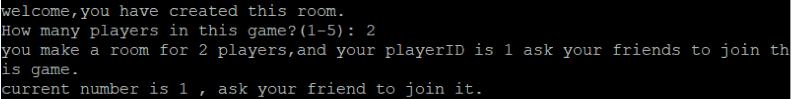
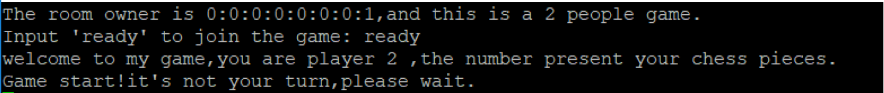
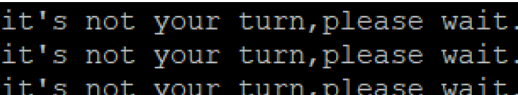
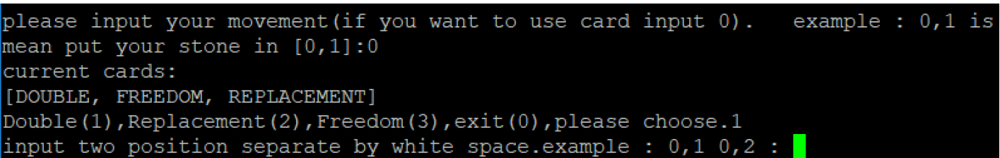

# Multi-player board game

This is the report of universy assignment (CE303), a multi-player board game. The server is implemented by **socket** and the client is made by **Putty**.
Please follow the instruction to run this game, the players are expected to see “Server start” message when the server is running.
1. Open cmd
2. Cd to BoardGame303\out\production\BoardGame303
3. Java Server
4. Open Putty, localhost:8888, raw
Below is a brief instruction of how to play this game, the client displays precise notification message to guild player on the next move.
You can see a welcome message and ask you how many players in total. Please enter the number of players, for example, 2, press enter(1 means playing with bot). You can see the message below.

Then open a new Putty window with same socket, this client is representing the player2, you can see this message to ask you key in “ready” to join the game. After that, you can expect to see this message:

Now, the game begins, the player 1 could place stone by entering coordinates in the format of “ROW, COL” such as 4,3
When the game in the player 1’s turn, the player 2 can’t do anything, a message says “it’s not your turn” will appear every 3 seconds until player 1 made a move.

The players could key in “0” to use card, player could see this panel when entering the card mode:

The player could key in number 1~3 to select from 3 cards, or key in 0 to exit to normal move. There are instructions of how to use individual card.
This is basically everything to know of how to run the game and how to play this game.

# Implementation

## Server

The Server class is the entry point of this program, it creates a socket with port 8888, and accept method listening the connection until a client connects.

The ServerHandler contains the logic of connections between server and client. In this class, the code first check for the room status to know whether the room is newly created, if the room is created by player, then this player is the owner of the game, an owner will assign player Id 1. Meanwhile, the owner should enter the number of players in this game. This number will be used to check if the room is full, hence the game could start, this is done by ServerHandler. observeTheRoom method.

In ServerHandler. gameStart method, depends on the number that the owner set, the opponent is set to bot if the number is 1, if the number is 2~5, the game is a multiple player game with respective number of players. Respective logic applies. The gameplay logic will introduce later.

If this game is multi-player, assume it is a 1vs1 game. The game will ask the player 1 to invite the friends in. If the room status shows the room is exist, the owner’s information will be displayed, the game now ask player 2 to type “ready” to join the game.
A proper use of reader and writer to communicate between server and client.

## Gameplay
The SocketImpl class contains the game logic by implements the interface PlayerLogic, the interface has two methods: get player id and make move. This class mainly implement the makeMove method to get the player/bot’s move.

In the makeMove method, display the notification messages from server, and print the game board with text matrix. This method first check the input from player, if player enter “0”, the game enter the “card mode”, player could select a card to play, the method get the use’s input and split to x y coordinates, the Move class has a constructor with card, first move and second
move, the moves are type Coordinates, so I can use x y coordinates to construct moves. If player enter an illegal input, the exception handling will run the process one more time.

If the player made a good move (I’ll talk about how to check if the move is legal a bit later), simply replace the slot to player’s id. Originally, the empty slot is representing by 0, if player made a move, the slot will be that player’s id.
The detailed implementation of cards is of course different, but I think this part is rather simple, so I don’t talk about it in details, I have commented the code.

If player is not playing in card mode, which means in normal game, player take turns and place 1 stone on board, rules apply. This simply set the slot to player’s Id.

The GameState class contains very important logics of game, it monitors the game, make sure the game is under control.

The isMoveAllowed method takes 2 parameters of move and player to check if this player’s move is legal, in this project, whenever player need to make a move (e.g. makeMove and gameStart method), isMoveAllowed method must be called first. This method checks the moves if it out of the board, check the quantity of the card, a isAvailable method check the move is under the adjacent rule and check if the move is place on an empty slot.

The isAlive method iterate all slots, check if exist a slot that be possible to place a stone, if no such slot exist, the player is dead. The isGameEnd method check all player’s alive status, if all players dead, game is over, count the stones and get the winner in getWinner method.

# Concurrency

Create a thread for each player in Server class, all the codes of ServerHandler class are running in run method.

Atomic VS Synchronization:

The atomic package has the mechanic that check the operation is done in one step, operation changes the value in a local variable, then use new value to replace the old value. The most important feature of atomic operation is the operation can’t be interrupted half way, once start, all the way to end. So, it ensures the filed to be changed is consistent at all time.

I use AtomicInteger and AtomicReference<Boolean> type to store room status, player number, current player number, and current player id.

I use atomic operation to modify data, for example, use compareAndSet (expected, new) method when owner create the room, if the data in atomic equal to expected, then assign new data to it.

Another advantage of using atomic variable is Atomic variables offer a better performance than synchronization.

# Bot

The botImpl class contains a simple logic that make random legal moves.

I try to implement a smart AI but failed. Let me describe the idea:

1. Implement Minimax algorithm
2. Iterate the game, find all the possibilities until the end game, if win, return 10, if lose, return -10, if draw, return 0;
3. The Ai aim to have the best result at the end, so the iteration depth should be as deeper as possible.
4. Every move has a final score, The AI will always pick the best move, meanwhile, the AI should expect that the opponent always finds his best move.
5. Call this minimax recursion until end game.
6. The performance is not good if recursion too deep, it may take hours to calculate a move, in this case, the AI should use pruning algorithm to take out redundant selection, for example using alpha-beta pruning algorithm.
7. The alpha-beta pruning algorithm should use recursion to implement, take parameter of value of alpha and beta, they are the best search result and worst result for opponent. So, if a search result is less than alpha, it should be ignored, because it is not possible to be the best move, if a search result is bigger than beta, it should be ignored as well, because the opponent will find the better move. In both case, the algorithm could take out the whole node, hence save a lot of time.
8. The alpha-beta pruning and Minimax algorithm could eventually find the best result, I also think about the Monte Calro Tree Search algorithm applied on AlphaGo Zero, which is the best version of AlphaGo so far. This algorithm makes a random move, until end game, evaluate the move by backpropagation. Play this game 1 million times between bots to increase the accuracy, the efficiency could be boosted by All-Moves-As-First heuristics.

# Conclusion

The game is an extension of “Bank” project in lecture notes and labs. The initial set up of the game structure is similar with how bank account communicates with bank server and make transitions.

The difficulties of making this game are various, first, the communication between client and server, by studying the code provided again and again, I finally understand how it works. Secondly, the gameplay mechanism, it’s basically make a move object, and check the rules, and replace the slot with player number, however, it is time consuming and easy to produce bugs. And the last, the concurrency issues, one is the process control, determine which player’s turn. It uses AtomicReference and spin lock, when game start, use atomic reference to get the player id, because every player is a thread, so if the current thread is player’s thread, the player could input move, otherwise the current thread waiting for current player’s move. When current player finished, increase the atomic reference to next player(GameState.CUR_PLAYER_ID), and repeat. The other issue is the consistence of data, the board data is static, so there is only one thread can interact with the board.

The problems are always happened during development, and I need always search on YouTube tutorials and StackOverFlow to learn new staff, especially concurrency.

The player UI was planning to use Java Swing to implement, then I find use player id and matrix to output the board is a way easier, so I use Putty to displace board and messages, I made a complete instruction on how to play this game while player is playing, for example, tell player to move or wait, how to use card, which card to use etc.. The player should be able to play this game without any instruction.

The overall feeling of this project is complex and time consuming, especially when CE301 final year project and CE318 computer game programming project making at the same time, different topics, different languages could slow down the progress a lot, and there are 2 tests in the middle, so I can’t further develop this game to a new level, such as bot battle, minimax algorithm, GUI…

